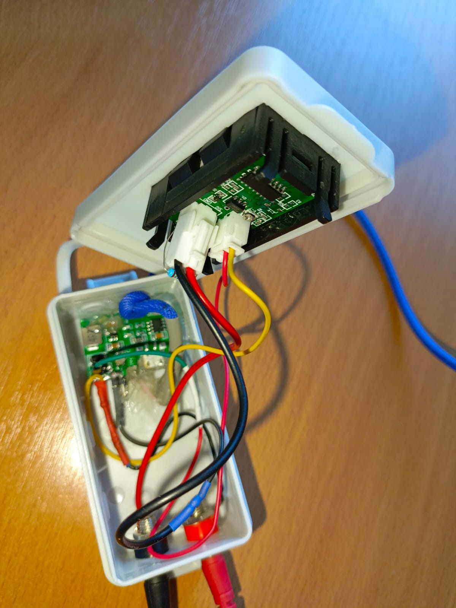

# -005-Tester_Led_volt_amper
Тестер Led светодиодов, показывает напряжение и силу тока светодиода (актуально для ремонта вышедших из строя Led светильников)
* Проект реализован из китайских модулей повышения напряжения и Вольметр/Амперметр
* Схема устройства:

# Готовое устройство, проект реализован полностью.

    
    

